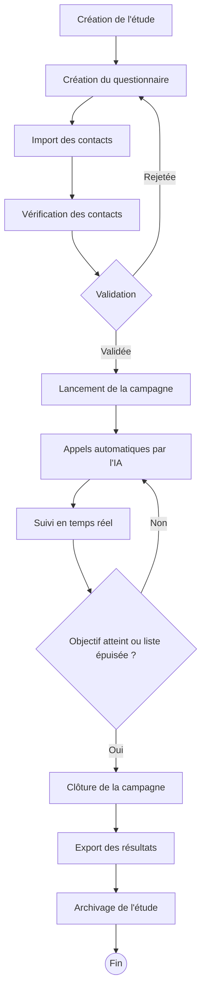
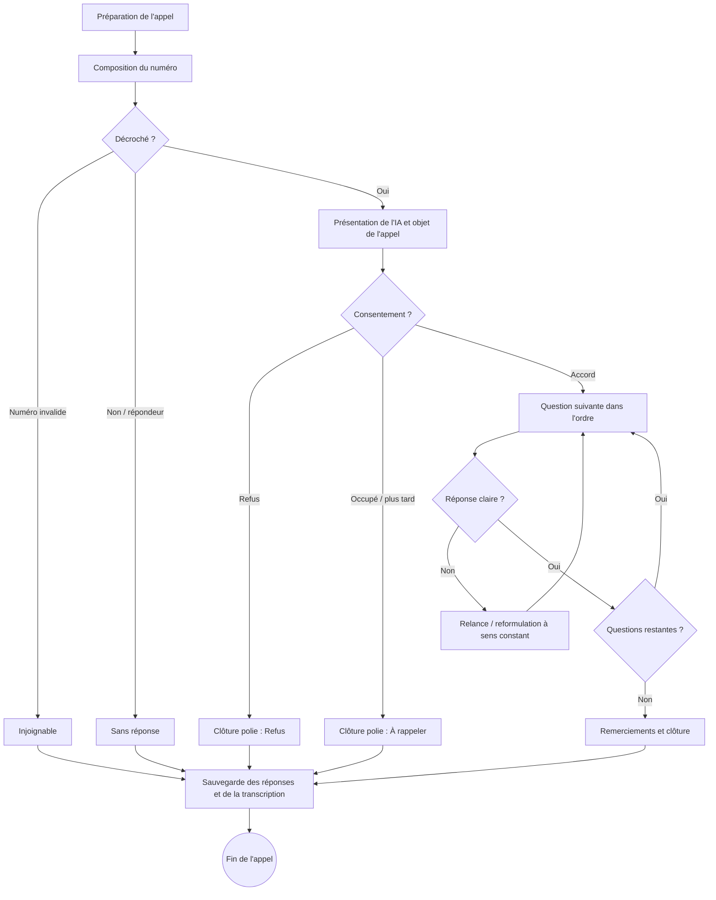
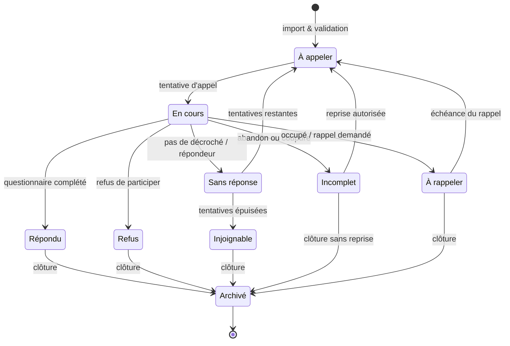

# 04. Besoins métier — Premier client

> 🟢 **Document rédigé — Référence métier officielle de la V1.**
> Analyse métier de la **première version** de VoiceSurvey AI, centrée
> exclusivement sur le besoin réel du premier client.
>
> Ce document décrit **le métier**, pas la solution technique. Il ne contient
> aucune proposition d'architecture, de base de données, d'API ni d'interface.
>
> **Publics visés :** Product Owner (comprendre le besoin), développeur
> (comprendre le métier sans connaître le secteur), UX Designer (imaginer les
> écrans), Architecte Logiciel (préparer l'architecture fonctionnelle).

---

## Sommaire

1. [Cadre et objectif](#1-cadre-et-objectif)
2. [Contexte client](#2-contexte-client)
3. [Fonctionnement actuel (manuel)](#3-fonctionnement-actuel-manuel)
4. [Difficultés, pertes de temps et risques](#4-difficultés-pertes-de-temps-et-risques)
5. [Fonctionnement souhaité (cible)](#5-fonctionnement-souhaité-cible)
6. [Fonctionnalités indispensables](#6-fonctionnalités-indispensables)
7. [Rôles utilisateurs](#7-rôles-utilisateurs)
8. [Parcours utilisateur complet](#8-parcours-utilisateur-complet)
9. [Scénarios métier de bout en bout](#9-scénarios-métier-de-bout-en-bout)
10. [Cycle de vie d'une étude](#10-cycle-de-vie-dune-étude)
11. [Cycle de vie d'un appel](#11-cycle-de-vie-dun-appel)
12. [Cycle de vie d'un contact](#12-cycle-de-vie-dun-contact)
13. [Typologie des questions](#13-typologie-des-questions)
14. [Contraintes métier](#14-contraintes-métier)
15. [Règles métier](#15-règles-métier)
16. [Gestion des erreurs métier](#16-gestion-des-erreurs-métier)
17. [Cas limites](#17-cas-limites)
18. [Indicateurs métier (KPI) et critères de réussite](#18-indicateurs-métier-kpi-et-critères-de-réussite)
19. [Hors périmètre (V1)](#19-hors-périmètre-v1)
20. [Questions en attente de validation](#20-questions-en-attente-de-validation)
21. [Glossaire](#21-glossaire)
22. [Historique du document](#22-historique-du-document)

---

## 1. Cadre et objectif

Nous mettons volontairement de côté toutes les fonctionnalités futures du
moteur (satisfaction, qualification de prospects, prise de rendez-vous, support,
recrutement, standard). **L'objectif de cette première version n'est pas de
construire un logiciel complet, mais de répondre parfaitement au besoin réel du
premier client.**

Ce besoin est unique et précis : **automatiser la réalisation d'études de marché
par téléphone**, aujourd'hui effectuées manuellement par des enquêteurs humains,
grâce à une intelligence artificielle capable de mener une conversation
naturelle tout en respectant scrupuleusement un questionnaire et des règles
définies.

L'IA doit **remplacer l'enquêteur humain** sur la conduite de l'appel, sans
trahir le sens des questions ni la rigueur méthodologique attendue d'une étude.

---

## 2. Contexte client

Le client est une structure qui réalise des **études de marché par téléphone**
pour le compte de ses propres clients (les commanditaires des études).

- Son métier est de **collecter des réponses fiables** auprès d'un échantillon
  de personnes (le « panel »), à partir d'un **questionnaire** défini.
- Aujourd'hui, ces appels sont passés **un par un, manuellement**, par des
  enquêteurs qui lisent le questionnaire, posent les questions, notent les
  réponses, puis transmettent les résultats.
- Le volume d'appels est élevé et répétitif, la valeur ajoutée humaine réelle
  est faible pendant l'appel (lecture + saisie), mais le coût et le temps sont
  importants.

Le besoin du client est donc d'**augmenter le volume traité, de réduire le coût
et le délai, et d'homogénéiser la qualité**, sans dégrader la fiabilité des
données collectées.

---

## 3. Fonctionnement actuel (manuel)

Cette section décrit, étape par étape, comment une étude se déroule aujourd'hui.

### 3.1 Préparation d'une étude

1. Le commanditaire exprime un besoin (sujet de l'étude, cible, nombre de
   réponses attendues, délai).
2. Un **questionnaire** est rédigé : liste de questions ordonnées, avec parfois
   des **règles de branchement** (« si la personne répond non à la question 3,
   passer directement à la question 7 »).
3. Les questions sont de différents types : choix unique, choix multiple, échelle
   de notation, oui/non, question ouverte (réponse libre).
4. Le questionnaire est relu et validé avant le lancement.
5. Un **objectif de réponses** est fixé (ex. « 300 questionnaires complétés »).

### 3.2 Obtention des contacts

1. Une **liste de contacts** est constituée (numéros de téléphone, et souvent
   nom, prénom, et quelques attributs : ville, tranche d'âge, segment…).
2. Cette liste provient d'un fichier fourni par le commanditaire, d'un panel
   existant, ou d'une base achetée/louée.
3. La liste est souvent un **fichier tableur (CSV ou Excel)**, plus ou moins
   propre (doublons, numéros invalides, colonnes hétérogènes).

### 3.3 Réalisation des appels

1. Chaque enquêteur reçoit une portion de la liste.
2. Il appelle les contacts **un par un**.
3. À chaque appel, plusieurs issues sont possibles :
   - personne **ne répond pas** ;
   - **numéro invalide** / injoignable ;
   - la personne **refuse** de participer ;
   - la personne **accepte** mais n'a pas le temps (à rappeler) ;
   - la personne **accepte et répond** au questionnaire.
4. Pendant l'appel, l'enquêteur **lit les questions**, **adapte parfois la
   formulation** pour rester naturel, **relance** si la réponse est floue, et
   **respecte les branchements**.

### 3.4 Notation des réponses

1. L'enquêteur **saisit les réponses** au fur et à mesure (sur papier, tableur
   ou outil interne).
2. Les réponses ouvertes sont **résumées ou retranscrites** à la main.
3. Le statut de chaque contact est noté (répondu, refus, sans réponse, à
   rappeler, injoignable).

### 3.5 Exploitation des résultats

1. Les réponses de tous les enquêteurs sont **regroupées**.
2. On calcule des **statistiques** (répartition des réponses, pourcentages).
3. Les réponses ouvertes sont **lues et synthétisées**.
4. Un **rapport** est produit pour le commanditaire, accompagné d'un **export**
   des données brutes.

---

## 4. Difficultés, pertes de temps et risques

### 4.1 Difficultés rencontrées

- **Disponibilité des enquêteurs** : capacité limitée par le nombre de personnes
  et leurs horaires.
- **Hétérogénéité de la qualité** : deux enquêteurs ne mènent pas l'appel de la
  même façon ; le ton, les relances et les reformulations varient.
- **Fatigue et lassitude** : la répétition entraîne erreurs de saisie et baisse
  de qualité en fin de journée.
- **Listes de contacts imparfaites** : doublons, numéros faux, données
  incomplètes à nettoyer manuellement.

### 4.2 Pertes de temps

- **Appels improductifs** : une grande partie des appels n'aboutit pas (sans
  réponse, refus, injoignable), mais consomme du temps.
- **Saisie manuelle** des réponses, en double du temps de l'appel.
- **Synthèse manuelle** des réponses ouvertes.
- **Consolidation manuelle** des résultats de plusieurs enquêteurs.
- **Rappels** non systématisés et difficiles à suivre.

### 4.3 Risques

- **Erreurs de saisie** et fautes de respect des branchements (question posée à
  tort, ou oubliée).
- **Biais d'enquêteur** : la formulation ou le ton influencent la réponse.
- **Incohérence des données** entre enquêteurs.
- **Perte de données** (notes papier, fichiers épars).
- **Confidentialité** : manipulation de données personnelles (numéros, noms,
  réponses) sans cadre homogène.
- **Non-atteinte de l'objectif** de réponses dans le délai imparti.

---

## 5. Fonctionnement souhaité (cible)

Le futur processus reprend les mêmes étapes métier, mais l'appel et la saisie
sont **automatisés par l'IA**. Voici le déroulé cible, étape par étape.

### Étape 1 — Création d'un questionnaire

L'utilisateur crée un questionnaire :

- titre et objectif de l'étude ;
- liste **ordonnée** de questions ;
- pour chaque question : son **type** (choix unique, choix multiple, échelle,
  oui/non, ouverte), son **libellé**, et ses **réponses possibles** le cas
  échéant ;
- indication de si la question est **obligatoire** ou facultative ;
- éventuellement une **consigne** pour l'IA (comment relancer, comment
  reformuler sans changer le sens).

### Étape 2 — Import d'une liste de contacts

L'utilisateur importe un **fichier CSV** de contacts :

- au minimum le **numéro de téléphone** ;
- idéalement des attributs (nom, prénom, ville, segment…) ;
- le système doit accepter des fichiers réels, donc imparfaits.

### Étape 3 — Vérification des données

Avant le lancement, le système aide à **fiabiliser la liste** :

- détection des **doublons** ;
- détection des **numéros manifestement invalides** ;
- signalement des **lignes incomplètes** ;
- aperçu clair du nombre de contacts exploitables.

> Objectif métier : éviter de lancer une campagne sur une liste « sale ».

### Étape 4 — Lancement d'une campagne

L'utilisateur crée une **campagne** qui associe :

- **un questionnaire** ;
- **une liste de contacts** ;
- des **paramètres** : plage horaire d'appel autorisée, nombre de tentatives par
  contact en cas de non-réponse, objectif de réponses, durée maximale d'appel.

Puis il **lance** la campagne.

### Étape 5 — L'IA appelle automatiquement les contacts

Le système **passe les appels automatiquement**, contact après contact, en
respectant les plages horaires et les règles de tentatives. Il gère seul les
issues : sans réponse, refus, injoignable, à rappeler, répondu.

### Étape 6 — L'IA mène la conversation

Pendant l'appel, l'IA :

- se présente et explique l'objet de l'appel ;
- **demande le consentement** à participer ;
- pose les questions **dans l'ordre**, en respectant les **branchements** ;
- s'exprime de façon **naturelle**, peut **reformuler sans changer le sens** et
  **relancer** poliment si la réponse est imprécise ;
- respecte la **durée maximale** et sait **clore proprement** (refus, abandon,
  fin du questionnaire).

### Étape 7 — Les réponses sont enregistrées

Pour chaque appel, le système enregistre :

- la **réponse à chaque question** (structurée selon le type de question) ;
- la **transcription** de l'échange ;
- le **statut final** du contact (répondu / refus / sans réponse / injoignable /
  à rappeler / incomplet).

### Étape 8 — Un résumé est généré

Pour chaque questionnaire complété, l'IA produit un **résumé** lisible de
l'échange, mettant en valeur les points clés et les réponses ouvertes.

### Étape 9 — Les résultats sont consultés dans un tableau de bord

L'utilisateur suit l'étude : avancement de la campagne, nombre de réponses
obtenues, répartition des réponses par question, statuts des contacts,
indicateurs de réussite.

### Étape 10 — Export des données

L'utilisateur exporte les résultats (réponses brutes et/ou agrégées) aux formats
**Excel et CSV**, pour les transmettre au commanditaire ou les analyser ailleurs.

---

## 6. Fonctionnalités indispensables

Liste **restreinte au strict nécessaire** pour le premier client. Toute
fonctionnalité ne répondant pas directement à ce besoin est exclue (voir §19).

| # | Fonctionnalité | Pourquoi elle est indispensable |
|---|----------------|---------------------------------|
| 1 | **Gestion des contacts** | Constituer et consulter la base d'appel d'une étude. |
| 2 | **Import CSV** | Charger les listes réelles fournies au client. |
| 3 | **Vérification / nettoyage des contacts** | Doublons, numéros invalides, lignes incomplètes avant lancement. |
| 4 | **Création de questionnaires** | Définir les questions, leurs types et leurs réponses possibles. |
| 5 | **Logique conditionnelle (branchements)** | Respecter les « si… alors passer à… » indispensables aux études. |
| 6 | **Lancement de campagnes** | Associer questionnaire + liste + paramètres et démarrer les appels. |
| 7 | **Appels automatiques par l'IA** | Le cœur du besoin : remplacer l'appel manuel. |
| 8 | **Conduite naturelle de la conversation** | Mener l'entretien comme un enquêteur, avec relances et reformulations à sens constant. |
| 9 | **Suivi des appels** | Voir en temps réel l'état des appels et des contacts. |
| 10 | **Transcription** | Garder une trace fidèle de chaque échange. |
| 11 | **Enregistrement structuré des réponses** | Exploiter les réponses par question. |
| 12 | **Résumé IA** | Synthétiser automatiquement chaque entretien (surtout les réponses ouvertes). |
| 13 | **Statistiques** | Répartition des réponses et indicateurs d'avancement. |
| 14 | **Export Excel et CSV** | Livrer les données au commanditaire. |
| 15 | **Gestion des statuts & rappels** | Refus, sans réponse, à rappeler, injoignable, complété. |

> Note : l'**authentification** des utilisateurs et la **confidentialité des
> données** sont des exigences transverses (voir §14), pas des fonctionnalités
> métier à proprement parler, mais elles conditionnent la mise en service.

---

## 7. Rôles utilisateurs

La V1 vise une petite équipe interne. Trois rôles suffisent au besoin du premier
client.

### 7.1 Chargé d'études (utilisateur principal)

- **Responsabilités** : concevoir les questionnaires, importer et vérifier les
  contacts, lancer et suivre les campagnes, consulter et exporter les résultats.
- **Besoins** : créer une étude de bout en bout sans compétence technique,
  suivre l'avancement, obtenir des données exploitables.
- **Actions autorisées** : créer/modifier questionnaires, importer contacts,
  créer/lancer/mettre en pause une campagne, consulter le tableau de bord,
  exporter.

### 7.2 Superviseur / Responsable d'études

- **Responsabilités** : garantir la qualité méthodologique, valider les
  questionnaires, contrôler les résultats et les indicateurs.
- **Besoins** : vue d'ensemble de toutes les campagnes, accès aux indicateurs de
  réussite et à la qualité des réponses.
- **Actions autorisées** : tout ce que fait le chargé d'études, plus la
  **validation** des questionnaires/campagnes et la consultation transversale.

### 7.3 Administrateur

- **Responsabilités** : gérer les accès des utilisateurs et les paramètres
  généraux du logiciel.
- **Besoins** : maîtriser qui accède à l'outil et aux données.
- **Actions autorisées** : créer/désactiver les comptes, attribuer les rôles,
  gérer les paramètres globaux.

> Pour le premier client, une même personne peut cumuler plusieurs rôles. La
> distinction sert à clarifier les **responsabilités** et les **droits**.

### 7.4 Tableau récapitulatif des droits

Légende : ✅ autorisé · ⛔ non autorisé.

| Action | Chargé d'études | Superviseur | Administrateur |
|--------|:--------------:|:-----------:|:--------------:|
| Créer / modifier un questionnaire | ✅ | ✅ | ⛔ |
| **Valider** un questionnaire / une campagne | ⛔ | ✅ | ⛔ |
| Importer / vérifier des contacts | ✅ | ✅ | ⛔ |
| Créer / lancer / mettre en pause une campagne | ✅ | ✅ | ⛔ |
| Consulter le tableau de bord d'une campagne | ✅ | ✅ | ⛔ |
| Vue transversale de **toutes** les campagnes | ⛔ | ✅ | ⛔ |
| Exporter les résultats | ✅ | ✅ | ⛔ |
| Gérer les comptes et les rôles | ⛔ | ⛔ | ✅ |
| Gérer les paramètres globaux | ⛔ | ⛔ | ✅ |

> La répartition exacte des droits (notamment qui valide) est à confirmer avec
> le client — voir §20.

---

## 8. Parcours utilisateur complet

Déroulé de référence d'une étude de marché, **de la connexion à l'export**.

1. **Connexion** — le chargé d'études se connecte au logiciel.
2. **Création du questionnaire** — il saisit les questions, leurs types, leurs
   réponses possibles et les branchements, puis le fait **valider** par le
   superviseur.
3. **Import des contacts** — il importe le fichier CSV de la liste d'appel.
4. **Vérification des contacts** — il consulte le rapport de qualité (doublons,
   numéros invalides, lignes incomplètes) et corrige/écarte les contacts à
   problème.
5. **Création de la campagne** — il associe le questionnaire et la liste, puis
   règle les paramètres : plage horaire, nombre de tentatives, objectif de
   réponses, durée maximale d'appel.
6. **Lancement** — il démarre la campagne.
7. **Déroulement automatique** — l'IA appelle les contacts, mène les
   conversations, gère refus/sans réponse/rappels, et enregistre les réponses et
   transcriptions.
8. **Suivi en temps réel** — il surveille l'avancement sur le tableau de bord
   (appels passés, réponses obtenues, statuts, indicateurs).
9. **Gestion en cours de route** — il peut **mettre en pause / reprendre** la
   campagne si nécessaire.
10. **Clôture** — la campagne se termine quand l'objectif est atteint ou la liste
    épuisée.
11. **Consultation des résultats** — il analyse statistiques et résumés, y
    compris les réponses ouvertes synthétisées par l'IA.
12. **Export** — il exporte les données en Excel/CSV pour le commanditaire.

---

## 9. Scénarios métier de bout en bout

Cette section décrit, étape par étape, les principaux scénarios d'un appel
unitaire. Ils servent de base aux écrans (UX), aux règles (IA) et aux tests
métier. Le **statut de contact** résultant est indiqué entre parenthèses
(voir §12).

### 9.1 Appel réussi — questionnaire complété *(→ Répondu)*

1. L'IA compose le numéro ; la personne **décroche**.
2. L'IA se présente, explique l'objet de l'appel et **demande le consentement**.
3. La personne **accepte**.
4. L'IA pose les questions dans l'ordre, en respectant les branchements.
5. Si une réponse est floue, l'IA **relance** poliment.
6. Toutes les questions obligatoires sont posées et répondues.
7. L'IA **remercie** et clôt l'appel.
8. Les réponses, la transcription et le résumé sont **enregistrés**.

> **Exemple :** « Bonjour, je réalise une courte étude sur les habitudes
> d'achat… avez-vous 3 minutes ? » → la personne répond aux 8 questions →
> « Merci beaucoup, bonne journée. »

### 9.2 Refus immédiat *(→ Refus)*

1. La personne décroche.
2. L'IA se présente et demande le consentement.
3. La personne **refuse** (« non merci », « pas intéressé », « ne me rappelez
   plus »).
4. L'IA **respecte le refus immédiatement**, ne pose aucune question, clôt
   poliment.
5. Le contact est marqué **Refus** et **ne sera jamais rappelé** (voir §15).

### 9.3 Personne occupée *(→ À rappeler)*

1. La personne décroche.
2. À la demande de consentement, elle indique être **occupée** ou demande un
   **meilleur moment**.
3. L'IA propose / acte un **rappel ultérieur** et clôt poliment.
4. Le contact est marqué **À rappeler** ; un nouvel appel sera programmé.

### 9.4 Demande de rappel explicite *(→ À rappeler)*

1. La personne accepte le principe mais demande à être **rappelée plus tard**
   (ou pendant l'entretien, doit s'interrompre).
2. L'IA enregistre la **préférence de rappel** si exprimée.
3. Le contact passe en **À rappeler** ; les réponses déjà collectées sont
   conservées (entretien repris si la reprise est autorisée — voir §20).

### 9.5 Numéro invalide *(→ Injoignable)*

1. La composition échoue : numéro **inexistant, mal formé ou hors service**.
2. Aucun appel n'aboutit.
3. Le contact est marqué **Injoignable** (cause : numéro invalide) sans
   consommer de tentative de rappel utile.

### 9.6 Boîte vocale / répondeur *(→ Sans réponse)*

1. L'appel aboutit sur une **messagerie vocale**.
2. L'IA **ne laisse pas de message** (comportement par défaut, à confirmer §20)
   et raccroche.
3. Le contact est marqué **Sans réponse** ; il sera rappelé si des tentatives
   restent.

### 9.7 Appel interrompu (coupure) *(→ Incomplet ou À rappeler)*

1. L'entretien est en cours.
2. L'appel **se coupe** (réseau, raccrochage involontaire).
3. Les réponses **déjà obtenues sont sauvegardées**.
4. Le contact passe en **Incomplet** ; il peut être **reprogrammé** pour reprise
   (selon règle de reprise à valider, §20).

### 9.8 Questionnaire abandonné *(→ Incomplet)*

1. L'entretien a commencé (consentement donné, au moins une réponse).
2. La personne **met fin** volontairement avant la dernière question.
3. L'IA clôt poliment.
4. Les réponses partielles sont **conservées** ; le contact est marqué
   **Incomplet** (à distinguer d'un Refus, où aucune question n'a été répondue).

### 9.9 Tableau de synthèse des scénarios

| Scénario | Décroché | Consentement | Issue | Statut résultant | Rappel ? |
|----------|:--------:|:------------:|-------|------------------|:--------:|
| Appel réussi | Oui | Oui | Questionnaire complété | Répondu | Non |
| Refus immédiat | Oui | Non | Refus | Refus | **Jamais** |
| Personne occupée | Oui | Reporté | Reporté | À rappeler | Oui |
| Demande de rappel | Oui | Oui (partiel) | Interrompu volontairement | À rappeler | Oui |
| Numéro invalide | — | — | Composition impossible | Injoignable | Non |
| Boîte vocale | Non (répondeur) | — | Pas de contact humain | Sans réponse | Oui (si tentatives) |
| Appel interrompu | Oui | Oui | Coupure technique | Incomplet | Oui (reprise) |
| Questionnaire abandonné | Oui | Oui | Arrêt volontaire | Incomplet | Selon règle |

---

## 10. Cycle de vie d'une étude

Une **étude** suit un cycle de vie clair, de sa création à son archivage. Une
étude porte un questionnaire et donne lieu à une (ou plusieurs) **campagne(s)**
d'appels sur une liste de contacts.

### 10.1 Étapes

1. **Création de l'étude** — intitulé, objectif, commanditaire, cible.
2. **Création du questionnaire** — questions, types, réponses, branchements.
3. **Import des contacts** — chargement de la liste CSV.
4. **Vérification** — contrôle qualité de la liste (doublons, invalides,
   incomplets).
5. **Validation** — le superviseur valide questionnaire + paramètres.
6. **Lancement** — la campagne démarre.
7. **Appels** — exécution automatique par l'IA (boucle sur les contacts).
8. **Suivi** — supervision en temps réel des indicateurs.
9. **Clôture** — objectif atteint ou liste épuisée.
10. **Export** — production des fichiers Excel/CSV.
11. **Archivage** — l'étude est gelée et conservée pour référence.

### 10.2 Diagramme

> Une **étude clôturée** ne peut plus être modifiée ; ses résultats restent
> consultables et exportables (voir §15).

---

## 11. Cycle de vie d'un appel

Chaque appel suit le même déroulé, quelle que soit son issue. Cela garantit
l'homogénéité — un des bénéfices majeurs par rapport au manuel.

### 11.1 Étapes

1. **Préparation** — sélection du prochain contact à appeler, chargement du
   questionnaire et des consignes.
2. **Composition** — numérotation du contact.
3. **Présentation** — l'IA se présente et annonce l'objet de l'appel.
4. **Demande de consentement** — accord explicite avant toute question.
5. **Déroulement des questions** — dans l'ordre, en respectant les branchements.
6. **Relances** — reformulation / précision si la réponse est floue.
7. **Fin de l'appel** — remerciements et clôture (ou clôture anticipée :
   refus, abandon, coupure, durée maximale atteinte).
8. **Sauvegarde des données** — réponses, transcription, statut, résumé.

### 11.2 Diagramme

> La **durée maximale** d'appel (§14.1) peut interrompre l'entretien à tout
> moment ; les réponses déjà obtenues sont alors sauvegardées et le contact
> passe en **Incomplet**.

---

## 12. Cycle de vie d'un contact

Un contact possède à tout instant **un seul statut**. Les transitions ci-dessous
décrivent l'ensemble des évolutions possibles.

### 12.1 Statuts possibles

| Statut | Signification |
|--------|---------------|
| **À appeler** | Importé et valide, en attente d'un premier appel. |
| **En cours** | Un appel est en train de se dérouler. |
| **Répondu** | Questionnaire complété et exploitable. |
| **Incomplet** | Entretien commencé mais non terminé (abandon ou coupure). |
| **Sans réponse** | Aucun décroché humain (non-réponse ou boîte vocale). |
| **Refus** | A explicitement refusé de participer. |
| **À rappeler** | Décroché mais entretien reporté (occupé / demande de rappel). |
| **Injoignable** | Numéro invalide ou tentatives épuisées sans contact. |
| **Archivé** | Figé en fin de campagne, conservé pour référence. |

### 12.2 Diagramme

> **Règles fortes :** depuis **Refus** et **Répondu**, aucun rappel n'est
> possible (voir §15). Le passage **Incomplet → À appeler** (reprise) dépend
> d'une règle à valider (§20).

---

## 13. Typologie des questions

Le questionnaire est composé de questions **typées**. Le type détermine la forme
de la réponse attendue et le **comportement de l'IA**. La V1 couvre six types.

### 13.1 Oui / Non

- **Objectif :** trancher une question binaire.
- **Exemple :** « Avez-vous acheté ce produit au cours des 6 derniers mois ? »
- **Contraintes :** réponse limitée à oui ou non ; possibilité d'un « ne sait
  pas / ne se prononce pas » à confirmer (§20).
- **Comportement de l'IA :** si la personne donne une réponse ambiguë
  (« peut-être », « ça dépend »), relancer pour obtenir un oui ou un non clair.

### 13.2 Choix unique

- **Objectif :** sélectionner **une seule** option dans une liste fermée.
- **Exemple :** « Quelle est votre tranche d'âge : 18-24, 25-34, 35-49, 50+ ? »
- **Contraintes :** une et une seule réponse parmi les options définies.
- **Comportement de l'IA :** énoncer les options de façon naturelle ; si la
  réponse ne correspond à aucune, reformuler les choix ; si plusieurs sont
  citées, faire préciser **la** réponse principale.

### 13.3 Choix multiple

- **Objectif :** sélectionner **une ou plusieurs** options dans une liste.
- **Exemple :** « Parmi ces marques, lesquelles connaissez-vous : A, B, C, D ? »
- **Contraintes :** zéro, une ou plusieurs options ; éventuel maximum à définir.
- **Comportement de l'IA :** recueillir toutes les options citées ; confirmer
  la liste si besoin (« donc A et C, c'est bien cela ? »).

### 13.4 Échelle

- **Objectif :** situer un avis sur une échelle ordonnée (ex. accord).
- **Exemple :** « Êtes-vous : tout à fait d'accord, plutôt d'accord, plutôt pas
  d'accord, pas du tout d'accord ? »
- **Contraintes :** une valeur parmi les niveaux ordonnés définis.
- **Comportement de l'IA :** rappeler les niveaux si la personne hésite ;
  rattacher une formulation libre au niveau le plus proche, en confirmant.

### 13.5 Note

- **Objectif :** obtenir une **valeur numérique** sur une plage donnée.
- **Exemple :** « Sur une échelle de 0 à 10, quelle est la probabilité que vous
  recommandiez ce produit ? »
- **Contraintes :** nombre entier (ou décimal selon réglage) dans la plage
  définie (ex. 0–10).
- **Comportement de l'IA :** n'accepter qu'une valeur dans la plage ; relancer
  si la valeur est hors plage ou exprimée vaguement (« plutôt bien »).

### 13.6 Réponse ouverte

- **Objectif :** recueillir une réponse **libre**, qualitative.
- **Exemple :** « Pour quelles raisons principalement ? »
- **Contraintes :** texte libre ; pas de liste d'options.
- **Comportement de l'IA :** laisser s'exprimer, relancer une fois si la réponse
  est très courte ou hors sujet, puis **retranscrire fidèlement** ; ne pas
  forcer la personne à développer indéfiniment.

### 13.7 Tableau récapitulatif

| Type | Réponse attendue | Liste d'options | Relance IA typique |
|------|------------------|:---------------:|--------------------|
| Oui / Non | Binaire | Non | Obtenir un oui/non net |
| Choix unique | 1 option | Oui | Faire choisir une seule option |
| Choix multiple | 0..N options | Oui | Confirmer la liste citée |
| Échelle | 1 niveau ordonné | Oui | Rappeler les niveaux |
| Note | 1 valeur numérique | Non (plage) | Ramener dans la plage |
| Réponse ouverte | Texte libre | Non | Préciser si hors sujet / trop court |

> Chaque question peut être **obligatoire** ou **facultative**, porter une
> **consigne IA** (relance, reformulation) et déclencher un **branchement**
> selon la réponse (voir §15, RG-09).

---

## 14. Contraintes métier

Ces contraintes définissent le **comportement attendu** du logiciel face aux
réalités du terrain.

### 14.1 Durée des appels

- Un appel doit avoir une **durée maximale paramétrable** (objectif indicatif :
  un entretien court, de l'ordre de quelques minutes).
- Au-delà, l'IA doit **clore poliment** sans dénaturer l'étude.

### 14.2 Gestion des refus

- Si la personne **refuse** de participer, l'IA doit **respecter le refus
  immédiatement**, clore courtoisement, et marquer le contact comme « refus ».
- Un refus ne doit **pas** être rappelé.

### 14.3 Gestion des appels sans réponse

- En cas de **non-réponse** ou d'**injoignable**, le contact est **reprogrammé**
  selon le nombre de tentatives autorisées.
- Au-delà du nombre maximal de tentatives, le contact est marqué
  « injoignable » et n'est plus rappelé.

### 14.4 Reprise des campagnes

- Une campagne doit pouvoir être **mise en pause puis reprise** sans perte de
  progression ni de données déjà collectées.
- En cas d'interruption (incident, fin de plage horaire), elle doit **reprendre
  proprement** là où elle s'était arrêtée.

### 14.5 Qualité des réponses

- L'IA doit **relancer** lorsqu'une réponse est floue, incomplète ou hors sujet.
- Elle doit **respecter strictement les branchements** et ne poser que les
  questions pertinentes.
- Les réponses doivent être **rattachées sans ambiguïté** à la bonne question.
- Un questionnaire **interrompu** doit être identifié comme « incomplet ».

### 14.6 Confidentialité des données

- Les données manipulées (numéros, identités, réponses, transcriptions) sont des
  **données personnelles** et doivent être traitées de façon **confidentielle**.
- L'accès aux données doit être **réservé aux utilisateurs autorisés**.
- Le traitement doit pouvoir respecter la **réglementation applicable** sur la
  protection des données et le démarchage téléphonique.

### 14.7 Reformulation sans changement de sens

- L'IA peut **reformuler** une question pour rester naturelle et fluide, mais
  **sans jamais en altérer le sens** ni introduire de biais.
- La **liste des réponses possibles** d'une question fermée ne doit pas être
  modifiée par la reformulation.

### 14.8 Plages horaires d'appel

- Les appels ne doivent être passés que pendant les **plages horaires
  autorisées** définies pour la campagne.
- Hors plage, aucun appel n'est composé ; les rappels échus sont reportés à la
  prochaine plage valide.

---

## 15. Règles métier

Règles explicites et **non négociables** de la V1. Elles complètent les
contraintes du §14 et doivent guider la conception comme les tests.

| ID | Règle | Justification |
|----|-------|---------------|
| RG-01 | Un contact en **Refus** ne doit **jamais** être rappelé. | Respect de la personne et de la réglementation. |
| RG-02 | Un contact **Répondu** (complété) ne doit **jamais** être rappelé. | Éviter les doublons et le sur-démarchage. |
| RG-03 | Une **campagne clôturée** ne peut plus être modifiée. | Garantir l'intégrité des résultats livrés. |
| RG-04 | Un **questionnaire validé et lancé** ne doit plus être modifié pendant la campagne. | Comparabilité des réponses entre contacts. |
| RG-05 | Chaque réponse est rattachée à **une seule** question. | Exploitabilité et fiabilité des données. |
| RG-06 | Les appels ne sont passés que dans les **plages horaires autorisées**. | Conformité et acceptabilité. |
| RG-07 | Le nombre de **tentatives** par contact ne dépasse pas le maximum défini. | Maîtrise des coûts et du démarchage. |
| RG-08 | Le **consentement** est requis avant de poser la première question. | Éthique et conformité. |
| RG-09 | Les **branchements** sont respectés : aucune question non pertinente posée. | Fidélité méthodologique. |
| RG-10 | L'IA **ne modifie pas le sens** d'une question ni ses options. | Absence de biais. |
| RG-11 | La **durée maximale** d'appel ne peut être dépassée. | Respect du temps de la personne. |
| RG-12 | Toutes les questions **obligatoires** doivent être répondues pour un statut « Répondu ». | Définition d'un questionnaire exploitable. |
| RG-13 | Les données déjà collectées sont **conservées** même en cas d'abandon ou de coupure. | Aucune perte de données. |
| RG-14 | Une demande de **non-rappel** (opt-out) est définitive et prioritaire. | Respect de la volonté de la personne. |
| RG-15 | L'accès aux données est **restreint aux utilisateurs autorisés**. | Confidentialité. |

> Les valeurs paramétriques (durée max, nombre de tentatives, délai entre
> tentatives, plages horaires) sont **configurables par campagne** ; leurs
> valeurs par défaut restent à valider (§20).

---

## 16. Gestion des erreurs métier

Comportement attendu face aux aléas. L'objectif est qu'**aucun aléa ne provoque
de perte de données ni de comportement inacceptable** vis-à-vis de la personne.

| Cas | Détection | Comportement attendu | Statut résultant |
|-----|-----------|----------------------|------------------|
| **Numéro invalide** | Échec de composition / numéro mal formé | Ne pas réessayer inutilement ; consigner la cause | Injoignable |
| **La personne raccroche** | Fin de ligne soudaine | Sauvegarder les réponses déjà obtenues | Incomplet (ou À rappeler) |
| **Réponse incompréhensible** | Réponse hors sujet / ambiguë | Relancer / reformuler une à deux fois, puis passer ou noter « non exploitable » | En cours → suite |
| **Bruit empêchant la compréhension** | Audio inintelligible | Demander de répéter ; si persistant, proposer un rappel | À rappeler |
| **Interruption réseau** | Coupure technique de l'appel | Sauvegarder l'état ; reprogrammer pour reprise | Incomplet / À rappeler |
| **Erreur IA** | Comportement anormal de l'agent | Clore proprement sans nuire ; ne pas inventer de réponse ; signaler pour revue | À rappeler |
| **Reprise après incident** | Redémarrage du système / reprise de campagne | Repartir du dernier état connu, sans re-appeler les contacts déjà traités | (selon contact) |

Principes transverses :

- **Ne jamais inventer** une réponse non donnée.
- **Toujours sauvegarder** ce qui a déjà été collecté avant de clore.
- **Préférer un rappel** à la perte d'un contact lorsqu'un aléa technique
  empêche de terminer.
- **Tracer la cause** de chaque issue anormale pour le suivi qualité.

---

## 17. Cas limites

Situations exceptionnelles à anticiper, et leur traitement métier attendu.

| Cas limite | Traitement attendu |
|------------|--------------------|
| La personne **demande à ne plus jamais être appelée** (opt-out) | Marquer définitivement « ne pas rappeler » ; prioritaire sur toute campagne (RG-14). |
| La personne **ne parle pas la langue** du questionnaire | Clore poliment ; marquer comme non éligible (gestion multilingue hors V1, §20). |
| **Ce n'est pas la bonne personne** (mauvais interlocuteur) | Ne pas administrer le questionnaire ; statut à définir (Sans réponse / À rappeler). |
| **Mineur** ou personne manifestement non éligible | Clore poliment sans collecter ; marquer non éligible. |
| La personne **répond partiellement puis se ravise** (retire son consentement) | Stopper immédiatement ; conserver le minimum, marquer Incomplet/Refus selon le moment. |
| **Objectif de réponses atteint** alors que des appels sont en cours | Laisser se terminer les appels en cours ; ne plus en lancer de nouveaux. |
| **Liste épuisée** avant l'objectif | Clôturer la campagne ; signaler l'objectif non atteint. |
| **Même contact présent en double** dans la liste | Détecté en vérification (§5.3) ; un seul appel effectif. |
| **Même contact ciblé par deux campagnes** simultanées | À arbitrer (éviter le sur-démarchage) — voir §20. |
| **Rappel programmé hors plage horaire** | Reporté automatiquement à la prochaine plage autorisée (RG-06). |
| **Réponse « ne sait pas / ne se prononce pas »** à une question obligatoire | Comportement à définir : valeur dédiée vs relance — voir §20. |
| **Coupure en toute fin d'entretien** (dernière question répondue) | Considérer comme complété si toutes les obligatoires sont répondues (RG-12). |

---

## 18. Indicateurs métier (KPI) et critères de réussite

### 18.1 Indicateurs de volume et de performance

| Indicateur | Définition (métier) | Cible / lecture |
|------------|---------------------|-----------------|
| **Nombre d'appels** | Total des appels passés sur la campagne. | Volume d'activité. |
| **Taux de décrochés** | Appels avec décroché humain ÷ appels passés. | Plus haut = liste de meilleure qualité / bon créneau. |
| **Taux de réponse** | Contacts ayant accepté de répondre ÷ contacts joints. | Acceptation de l'étude. |
| **Taux de refus** | Refus ÷ contacts joints. | Plus bas = meilleure acceptation. |
| **Questionnaires terminés** | Nombre de questionnaires **complétés**. | Production utile de la campagne. |
| **Taux de questionnaires terminés** | Complétés ÷ entretiens commencés. | Capacité à aller au bout. |
| **Questionnaires abandonnés** | Entretiens commencés mais **incomplets**. | À minimiser. |
| **Taux de rappels** | Contacts passés en « À rappeler » ÷ contacts joints. | Charge de rappel induite. |
| **Durée moyenne** | Durée moyenne d'un entretien complété. | Doit rester dans la cible (§14.1). |
| **Coût moyen par appel** | Coût total ÷ nombre d'appels. | Pilotage budgétaire. |
| **Coût par questionnaire complété** | Coût total ÷ questionnaires complétés. | **Indicateur clé d'efficacité.** |
| **Progression de campagne** | Complétés ÷ objectif de réponses (%). | Avancement vers l'objectif. |

> Les **coûts** sont des indicateurs métier de pilotage ; leur mode de calcul
> précis (composantes prises en compte) est à valider avec le client (§20).

### 18.2 Indicateurs de qualité

- **Fidélité au questionnaire** : branchements respectés, aucune question posée à
  tort ou omise.
- **Exploitabilité des réponses** : réponses claires, correctement rattachées,
  réponses ouvertes correctement transcrites et résumées.
- **Respect des règles** : refus respectés, durée maximale tenue, plages
  horaires respectées.

### 18.3 Critère global de réussite (V1)

> La première version est considérée comme réussie si une étude de marché peut
> être menée **de bout en bout sans intervention humaine pendant les appels**,
> avec des données **aussi fiables qu'un enquêteur humain**, pour un **coût et un
> délai significativement réduits**, et dans le **respect des règles métier et de
> la confidentialité**.

---

## 19. Hors périmètre (V1)

Explicitement **exclus** de cette première version, pour rester concentrés sur
le besoin du premier client :

- Les autres cas d'usage du moteur (satisfaction, qualification de prospects,
  prise de rendez-vous, support client, recrutement, standard téléphonique).
- La **gestion des appels entrants** (la V1 se concentre sur les appels
  **sortants** d'études de marché).
- La **gestion multilingue** des conversations.
- Toute fonctionnalité de facturation, d'abonnement ou multi-entreprise.
- Toute fonctionnalité « confort » non nécessaire à la réalisation d'une étude.

> Ces éléments restent à la **roadmap** (voir `24_ROADMAP.md`) mais ne font pas
> partie du besoin à satisfaire maintenant.

---

## 20. Questions en attente de validation

Sujets à **trancher avec le client** avant de figer les règles. Chacun a un
impact direct sur le comportement attendu.

| # | Question | Impact |
|---|----------|--------|
| Q-01 | Quelle est la **durée maximale** d'un appel (valeur précise) ? | Règle RG-11 et clôture anticipée. |
| Q-02 | Combien de **tentatives** par contact, et quel **délai** entre elles ? | Statut Injoignable, taux de rappels, coûts. |
| Q-03 | Quelles **plages horaires** d'appel par défaut ? | Conformité, taux de décrochés. |
| Q-04 | L'IA doit-elle **laisser un message** sur boîte vocale ? | Scénario §9.6. |
| Q-05 | Un entretien **Incomplet** peut-il être **repris**, ou repart-il de zéro ? | Transition §12, scénarios 9.4 / 9.7. |
| Q-06 | Faut-il une valeur **« ne sait pas / ne se prononce pas »** ? | Typologie §13, cas limite §17. |
| Q-07 | Les appels sont-ils **enregistrés** (audio) et combien de temps conservés ? | Confidentialité §14.6, consentement. |
| Q-08 | Le **consentement à l'enregistrement** doit-il être demandé explicitement ? | Conformité. |
| Q-09 | Quelle est la **durée de conservation** des données personnelles et des réponses ? | Confidentialité, réglementation. |
| Q-10 | **Qui valide** les questionnaires et les campagnes (rôle exact) ? | Droits §7.4. |
| Q-11 | Comment gérer un **contact ciblé par deux campagnes** ? | Cas limite §17, sur-démarchage. |
| Q-12 | Quels **attributs de contact** sont obligatoires à l'import (au-delà du numéro) ? | Étape §5.2, vérification §5.3. |
| Q-13 | Quel **format précis** attendu pour les exports (colonnes, agrégats) ? | Étape §5.10. |
| Q-14 | Comment sont définis les **coûts** servant aux KPI ? | Indicateurs §18.1. |
| Q-15 | Existe-t-il une **liste rouge / opt-out** globale à respecter en amont ? | Règle RG-14. |

> Cette liste est vivante : toute nouvelle zone d'ombre identifiée pendant la
> rédaction des autres documents doit y être ajoutée.

---

## 21. Glossaire

- **Étude de marché** : collecte structurée de réponses auprès d'un échantillon
  de personnes pour le compte d'un commanditaire.
- **Commanditaire** : le client final qui commande l'étude.
- **Questionnaire** : ensemble ordonné de questions, avec types et règles.
- **Branchement (logique conditionnelle)** : règle qui modifie l'enchaînement
  des questions selon les réponses.
- **Contact** : une personne à appeler, identifiée au minimum par un numéro.
- **Campagne** : exécution d'un questionnaire sur une liste de contacts, selon
  des paramètres donnés.
- **Statut de contact** : état d'avancement d'un contact (à appeler, en cours,
  répondu, incomplet, sans réponse, refus, à rappeler, injoignable, archivé).
- **Tentative** : un appel passé vers un contact ; un contact peut faire l'objet
  de plusieurs tentatives selon les règles de la campagne.
- **Décroché** : fait qu'un humain réponde à l'appel (par opposition à une
  non-réponse ou une boîte vocale).
- **Boîte vocale (répondeur)** : messagerie répondant à la place de la personne.
- **Consentement** : accord explicite de la personne pour participer à l'étude.
- **Opt-out / liste rouge** : volonté de ne plus être appelé, à respecter
  définitivement et en priorité.
- **Plage horaire** : créneau pendant lequel les appels sont autorisés.
- **Questionnaire complété** : entretien mené jusqu'au bout, exploitable.
- **Questionnaire incomplet** : entretien commencé mais non terminé.
- **Transcription** : retranscription écrite de l'échange téléphonique.
- **Résumé** : synthèse lisible d'un entretien produite par l'IA.
- **KPI** : indicateur clé de performance servant à piloter une campagne.

---

## 22. Historique du document

| Version | Date | Auteur | Description |
|---------|------|--------|-------------|
| 1.0 | 2026-06-25 | CTO / Architecte | Rédaction initiale de l'analyse métier. |
| 1.1 | 2026-06-25 | CTO / Architecte | Revue & enrichissement : scénarios métier, cycles de vie (étude / appel / contact) avec diagrammes Mermaid, typologie des questions, gestion des erreurs, règles métier, cas limites, KPI étendus, questions en attente de validation. |

---

## Statut

- [x] Rédigé
- [x] Relu
- [ ] Validé
